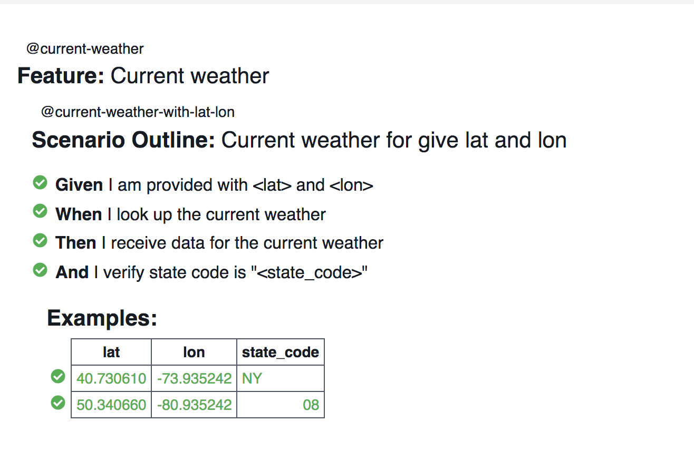
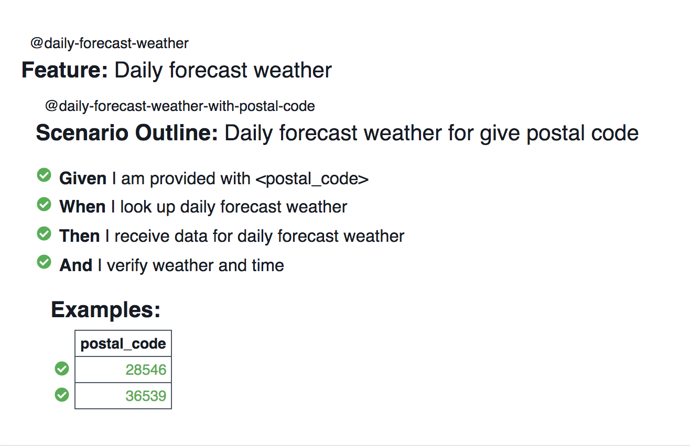

# WeatherBit API automation

- [WeatherBit API](https://www.weatherbit.io/api/swaggerui/weather-api-v2)
- [Notes and Assumptions](./docs/assumption.md)

## Prerequisite

- Java 1.8
- Maven 3.6

## Framework

- Testing approach - BDD

  - [Feature files](./src/test/resources/features)
  - [Step definitions](./src/test/java/stepDefinition)

- BDD tool - Cucumber
- Test tool - TestNg
- Build tool - Maven
- Configuration management - [Properties file](./src/test/resources/test.config.properties)

## Usage

- Run all scenarios in parallel

  ```sh
  mvn clean test
  ```

## Reports

- HTML report

  ```sh
  target/cucumber-html-report/index.html
  ```

  
  

- Json report

  ```sh
  target/cucumber.json
  ```

- Scenario report

  ```sh
  target/cucumber-pretty.txt
  ```

- XML report

  ```sh
  target/cucumber-results.xml
  ```
